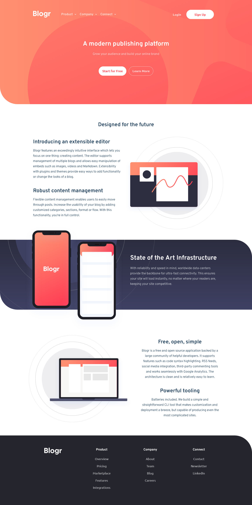

# Frontend Mentor - Blogr landing page solution

This is a solution to the [Blogr landing page challenge on Frontend Mentor](https://www.frontendmentor.io/challenges/blogr-landing-page-EX2RLAApP). Frontend Mentor challenges help you improve your coding skills by building realistic projects.

## Table of contents

- [Overview](#overview)
  - [Screenshot](#screenshot)
  - [Links](#links)
- [My process](#my-process)
  - [Built with](#built-with)
  - [What I learned](#what-i-learned)
- [Author](#author)

## Overview

### Screenshot

### Links

- Live Site URL: [Frontend Mentor Blogr Landing Page](https://frontend-mentor-blogr-landing-page-ten.vercel.app/)

## My process

Created initial files with Astro template.

### Built with

- React
- TypeScript
- Astro
- Flexbox
- Grid
- AOS

### What I learned

This is the first time I've used the Astro library. I really love it. I will definitely use it again. I'll try to link CMS to the file later to see how it works :) I took me 17 hours to code this while troubleshooting issues.

## Author

- Frontend Mentor - [@Pawel-Gnat](https://www.frontendmentor.io/profile/Pawel-Gnat)
